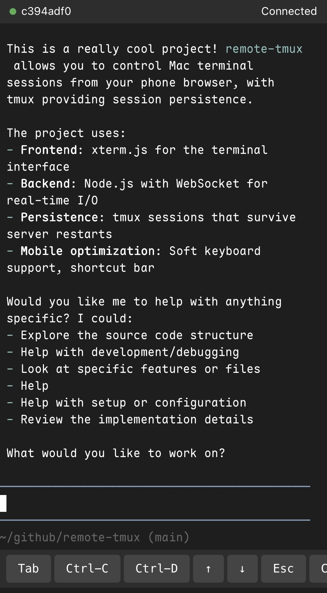

# remote-tmux

手机浏览器远程控制 Mac 终端。shell 运行在 tmux 中，服务重启不丢失会话。

[English](README.md)

<p align="center">
  
</p>

## 特点

- **tmux 持久化** — shell 进程跑在 tmux 里，server 重启后自动 reattach，终端内容不丢失
- **实时终端** — xterm.js 前端 + WebSocket 双向通信，支持颜色、光标、CJK 宽字符
- **断线补偿** — 断线自动重连带倒计时，RingBuffer 历史回放，seq 去重保证一致性
- **多 session** — 支持创建/切换/删除多个终端会话
- **移动端适配** — 软键盘自适应、横屏最大化、快捷键栏（Tab/Ctrl-C/Ctrl-D/↑/↓/Esc/Paste）
- **安全** — 静态 token 认证、IP 频率限制、审计日志（JSONL）
- **空闲清理** — 无客户端连接超时后自动销毁 session 和 tmux 进程
- **自托管字体** — Maple Mono NF CN（woff2，~6MB），支持中文和 Nerd Font 图标

## 安装

### 前置依赖

- **Node.js** >= 20
- **tmux** — macOS 用 Homebrew 安装：

```bash
brew install tmux
```

### 从源码安装

```bash
git clone https://github.com/user/remote-tmux.git
cd remote-tmux
npm install

# 启动
export WEBSHELL_TOKEN=your_secret_token
npx tsx src/cli.ts
```

### 构建后运行

```bash
npm run build

WEBSHELL_TOKEN=your_secret_token node dist/cli.js
```

## 快速开始

```bash
export WEBSHELL_TOKEN=your_secret_token
npx tsx src/cli.ts

# 浏览器访问
# http://localhost:3000?token=your_secret_token
```

## 环境变量

| 变量 | 默认值 | 说明 |
|------|--------|------|
| `WEBSHELL_TOKEN` | （必填） | 认证 token |
| `WEBSHELL_PORT` | `3000` | 监听端口 |
| `WEBSHELL_HOST` | `0.0.0.0` | 监听地址 |
| `WEBSHELL_COLS` | `120` | 默认终端列数 |
| `WEBSHELL_ROWS` | `36` | 默认终端行数 |
| `WEBSHELL_BUFFER_SIZE` | `50000` | RingBuffer 最大 chunk 数 |
| `WEBSHELL_MAX_INPUT` | `4096` | 单次输入最大字节数 |
| `WEBSHELL_PING_TIMEOUT` | `45000` | WS 心跳超时（ms） |
| `WEBSHELL_RATE_LIMIT_MAX` | `60` | 频率限制：窗口内最大请求数 |
| `WEBSHELL_RATE_LIMIT_WINDOW` | `10000` | 频率限制：窗口时间（ms） |
| `WEBSHELL_AUDIT_LOG` | （空=禁用） | 审计日志文件路径 |
| `WEBSHELL_IDLE_TIMEOUT` | `0`（禁用） | 空闲超时（ms），超时后自动清理 session |

## 手机访问

同一 WiFi 下直接用 Mac 局域网 IP：

```bash
# 查看 IP
ipconfig getifaddr en0

# 手机浏览器打开
# http://192.168.x.x:3000?token=your_secret_token
```

跨网络方案见 [docs/tailscale-setup.md](docs/tailscale-setup.md)。

## 架构

```
手机浏览器 (xterm.js)
    │ HTTP / WebSocket
    ▼
API Server (Node.js)
    │ pipe-pane (输出) / load-buffer (输入)
    ▼
tmux session (shell 持久化)
```

- **输出路径**：shell → tmux pipe-pane → 文件 → tail -f → RingBuffer → WS 广播
- **输入路径**：WS → tmux load-buffer + paste-buffer（串行队列保序）
- **重连恢复**：tmux capture-pane 纯文本快照 + RingBuffer 历史回放

## 项目结构

```
src/
├── cli.ts                  # 入口
├── server.ts               # HTTP/WS 服务 + 内联前端
├── config.ts               # 环境变量配置
├── types.ts                # 共享类型
├── core/
│   ├── session-manager.ts  # session 生命周期，tmux + pipe-pane I/O
│   ├── ring-buffer.ts      # 输出历史环形缓冲
│   ├── tmux.ts             # tmux 命令封装
│   └── idle-monitor.ts     # 空闲超时监控
├── middleware/
│   ├── auth.ts             # token 认证
│   ├── rate-limiter.ts     # IP 频率限制
│   └── audit-logger.ts     # 审计日志（JSONL）
└── routes/
    ├── sessions.ts         # REST API
    └── ws-terminal.ts      # WebSocket 终端
```

## 测试

```bash
npm test
```

## 许可

MIT
